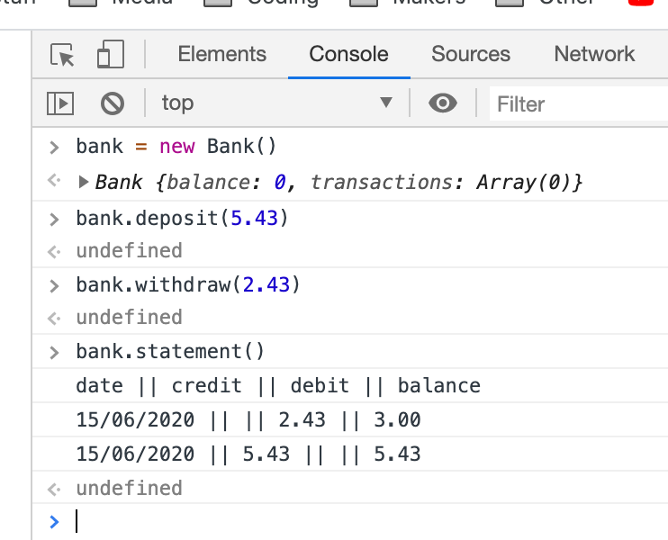

# Bank Tech Test

This is a simple bank program which runs in the JavaScript console in your browser. Tested using Jasmine.

## Approach

I have two classes for this - Bank and Transaction. The Bank class contains the main withdraw, deposit and statement functions. The Transaction class contains the transaction info, plus methods to return the statement for that transaction as a string. I used dependency injection so the Bank tests do not rely on the Transaction class working properly to pass.

## Running the program

To run, simply clone the repo and open index.html in your browser. Type the following into the console to use the program.

First create an instance of the bank class.

```javascript
let bank = new Bank();
```

To deposit use the deposit function, sending the amount as an argument.

```javascript
bank.deposit(500);
```

To withdraw use the withdraw function, sending the amount as an argument.

```javascript
bank.withdraw(300);
```

To view the bank statement, use the statement function.

```javascript
bank.statement();
```

Here is an example of the program running.



## Tests

To run tests open SpecRunner.html in your browser.
